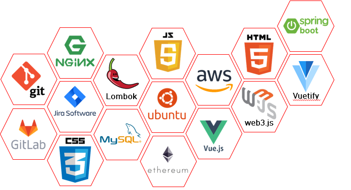

# Guranticket : 개런티켓
> - Guarantee + Ticket
> - 블록체인의 투명성을 활용한 공정한 티켓거래 플랫폼

## 목차
- [팀원](#팀원)
- [개요](#개요)
- [기능](#기능)
- [기술 스택](#기술-스택)
- [기술 설명](#기술-설명)
	- [ERD](#erd)
	- [SEQD](#seqd)
	- [REST API](#rest-api)
- [테스트 방법](#테스트-방법)

## 팀원

|  이름  |        역할         |
| :----: | :-----------------: |
| 조민기 | 팀장 및 Tech Leader |
| 이세림 | Front-end 개발      |
| 김승범 | Back-end 개발       |
| 권민지 | Front-end 개발      |

## 개요
> 1. 발권 업계 및 이벤트 관리 분야에서 암표 거래로 인해 생긴 소비자 피해액은 수십억 달러 
> 2. 2016년 한해동안 공연 티켓을 대량으로 사들여 이를 다시 프리미엄가를 붙여 일반인들에게 되팔아 생기는 차익이 자그마치 50억 달러 
> 3. 전문가들에 따르면 인기 많은 공연/이벤트 일수록 암표상들의 주 타겟이 되며 전체 티켓의 4분의 1에 달하는 티켓이 정가보다 700% 비싼 가격으로 암시장에서 거래 
**\=> 실제로 공연을 보기 위해 티켓을 구매하는 소비자들에게 불공정한 시장이 조성**

## 기능
|번호|기능|기대효과|
|:--:|----|--------|
|1|공연사와 계약 보장|블록에 기록된 예매내역을 통해 계약 신뢰성 보장|
|2|구매자-사용자 불일치 시 입장불가|QR코드를 발급하여 입장시 확인|

## 기술 스택
|PART|TECH|
|:--:|----|
|FRONTEND|`Vue.js` `Vuetify`|
|BACKEND|`Spring Boot` `MyBatis` `Lombok`|
|BLOCKCHAIN|`Go-Ethereum` `web3.js` `web3j` |
|DATABASE|`MySQL`|
|SERVER|`AWS EC2 Ubuntu 18.04` `Nginx` `Spring Boot Tomcat 8.0` `SSL`|
|CO-WORK|`GitLab` `Slack` `Notion` `Jira` `Google Docs` `ERD Cloud` `Dirgrams`|

## 기술 설명

### ERD

### SEQD

> #### 회원

 
> #### 공연

 
> #### 티켓

### REST API

## 테스트 방법
> - URL : https://j3b101.p.ssafy.io/
> - TEST ID : test@test.com
> - TEST PW : qqqq1111
> - 또는 테스트용 로그인(일반/기업/관리자)으로 로그인 가능
> - *<i>공통적으로 티켓구매, 회원정보수정이 가능함</i>
> - *<i>일반회원의 경우 예매확인 가능</i>
> - *<i>기업회원의 경우 공연등록 신청 가능</i>
> - *<i>관리자의 경우 공연등록 신청관리 가능</i>
